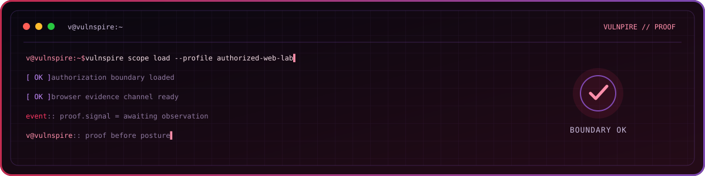

<div align="center">

# `v1xtron` // `NIGHTSHIFT`

### security research · AI engineering · builder

[](https://vulnspire.com)
[](https://cyberpars.com)



> I build security systems for authorized web testing — part researcher, part engineer, always looking for the signal others missed.

</div>

## `whoami`



<details>
<summary>open the terminal output</summary>

```text
handle     : v1xtron
callsign   : V
mode       : confident, curious, diligent, always learning
focus      : security research / AI engineering / developer tooling
sidequests : bug bounty / CTFs / reversing / strange systems
```

</details>

I’m **V**, online as **v1xtron**. My work sits where application security, automation, and developer tooling overlap. I like turning vague signals into clean explanations, reproducible findings, and stronger defenses.

## `workbench`

| Project | Role / direction |
| --- | --- |
| **[Vulnspire](https://vulnspire.com)** | Building an AI-native PTaaS for continuous, authorized web security validation. |
| **[Cyberpars Cybersecurity](https://cyberpars.com)** | Co-founder delivering penetration testing, red-team work, and security services. |
| **Independent research** | Bug bounty work, vulnerability research, tooling, and technical experiments. |

## `track record`

| Marker | Detail |
| --- | --- |
| `7+ years` | Offensive security, penetration testing, and vulnerability research. |
| `200+` | Security assessments, penetration tests, and adversary-simulation engagements. |
| `1,000+` | Valid vulnerability reports across authorized programs, including duplicates. |
| `100+` | Organizations reached through assessments, disclosure, and security research. |

## `focus`

| Area | What I work on |
| --- | --- |
| **Web, API & AI security** | Authentication, authorization, business logic, API workflows, LLM application surfaces, and browser-backed validation. |
| **Internal & Active Directory** | Attack-path mapping, privilege boundaries, lateral-movement analysis, and defensive recommendations. |
| **Red team operations** | Adversary simulation, control validation, threat-informed testing, and purple-team feedback. |
| **Cloud & infrastructure** | AWS, GCP, Azure, containers, Linux, exposed assets, and configuration review. |
| **Recon & automation** | OSINT, attack-surface mapping, discovery pipelines, HTTP analysis, and repeatable tooling. |
| **Reverse engineering** | Binary behavior, malware analysis, protocol inspection, debugging, and forensic research. |

## `inside vulnspire`

```text
┌─ the direction ────────────────────────────────────────────────────┐
│ AI agents · browser validation · web/API security · durable evidence │
│ reproducible proof · findings pipelines · secure automation          │
└─────────────────────────────────────────────────────────────────────┘
```

I’m building Vulnspire around a simple idea: let automation handle the repetitive work, while every important claim stays tied to something a browser actually did.

## `build log`

| Project | Focus |
| --- | --- |
| **[Vulnspire](https://vulnspire.com)** | AI-native PTaaS, autonomous discovery, browser proof, evidence, and findings workflows. |
| **[Banshee-AI](https://github.com/Vulnpire/Banshee-AI)** | AI-assisted OSINT, reconnaissance, and attack-surface discovery. |
| **[Arsenal](https://github.com/Vulnpire/Arsenal)** | Security tools, scripts, templates, and field notes. |
| **[Wayfuzz](https://github.com/Vulnpire/wayfuzz)** | Focused wordlist generation from archived web paths. |

## `toolkit`

**Languages** · `Go` · `Python` · `TypeScript` · `JavaScript` · `Bash` · `PowerShell` · `Rust` · `C/C++` · `SQL`

**Security** · `Burp Suite` · `Ghidra` · `Frida` · `Wireshark` · `Nmap` · `BloodHound` · `Impacket` · `Playwright`

**Systems** · `Linux` · `WSL` · `Docker` · `Kubernetes` · `AWS` · `GCP` · `Azure` · `CI/CD`

## `after hours`

- **Bug bounty:** keep looking after the workday ends; the best leads are often the quiet ones.
- **CTFs:** reversing, exploitation, and odd systems for the fun of solving hard problems.
- **Learning:** learn → explore → build → test → share → repeat.

I’m deliberate with details, comfortable with hard problems, and happiest when a vague signal becomes a result someone else can verify.

## `operator_console`



> A visual study of a proof-first control plane: quiet interface, sharp edges, no theatrics.

<details>
<summary><code>topics I keep returning to</code></summary>
<br />

Web and API security · AI security · vulnerability research · automation · reconnaissance · threat hunting · reverse engineering · detection engineering · DevSecOps · adversary emulation · open-source tooling

</details>

<div align="center">

### [Vulnspire ↗](https://vulnspire.com) · [Cyberpars Cybersecurity ↗](https://cyberpars.com)

<br />

`night shift · sharp eyes · clean proof`

</div>
